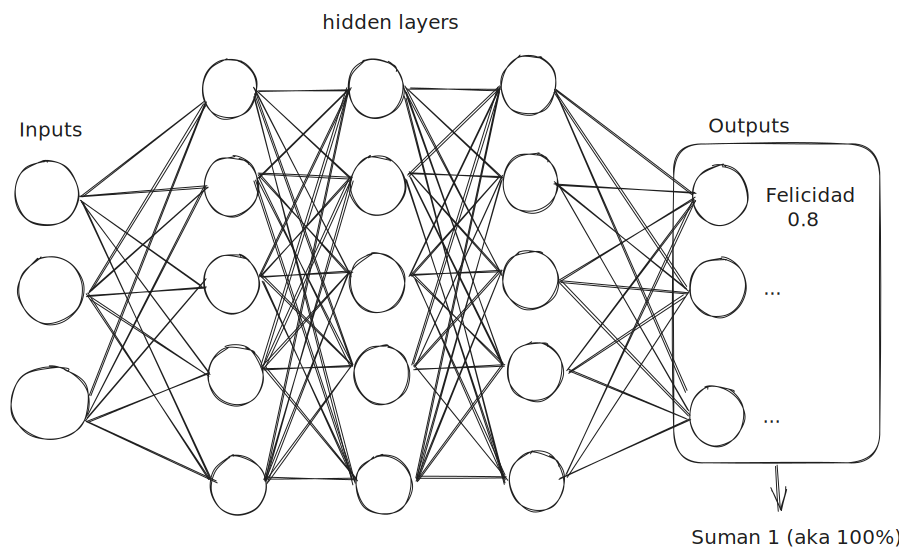

## Developer tools

- [ ] Develop a tool that allows to start the [[unity]] development of the VR experience
- [ ] Explore possibilities with unity

## Project Architecture meeting

- [x] Understand the possibility of switching the [[../Documentation/Experiment design|experiment design]]
- [x] Understanding the questions we want to ask
- [ ] Diagram and document both architectures

## INC Mty Stand

- [ ] Plan some stuff for our [[INC Mty]] stand

## After the meeting notes

This diagram was made to illustrate (in general) what a [[neural network]] looks like

[[Meeting notes 18-07-2023|Next Meeting Notes]]