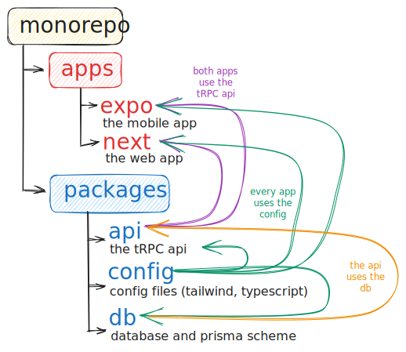

**A monorepo is a single repository containing multiple distinct projects, with well-defined relationships.**

Basically, is a single repository that contains different *(modular!)* apps and packages. Each app is independent from each other, but they can share code between them. For example, you could have a monorepo with a structure like this.

As you can see on this diagram, we have different packages and apps *(can be developed individually)* and we can reuse them between apps. For example, both the [Expo](Expo) and [Nextjs](Nextjs.md) use the `api` package to consume the tRPC API.

## Caching

One of the drawbacks of a monorepo is that building a ton of apps can be slow, which is why building good caching mechanisms to never build the same version of an app twice becomes really important *(Both in local development and [[CI/CD]])*. [Turborepo](Turborepo.md) is a tool that helps us deal with these type of problems by default

